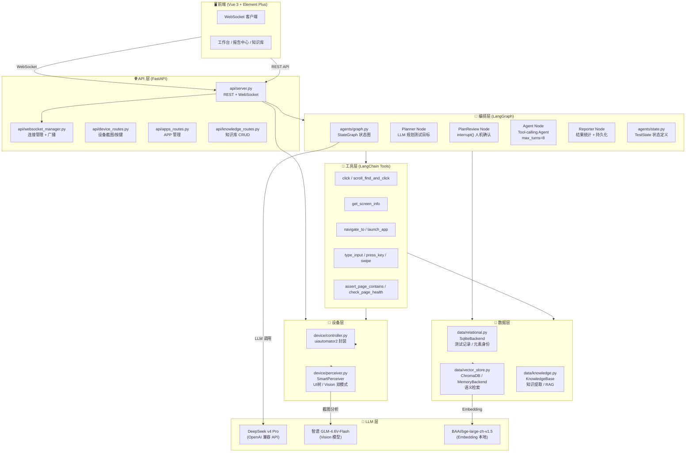
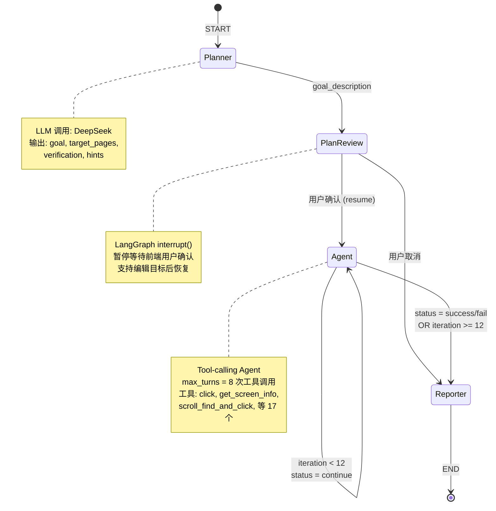
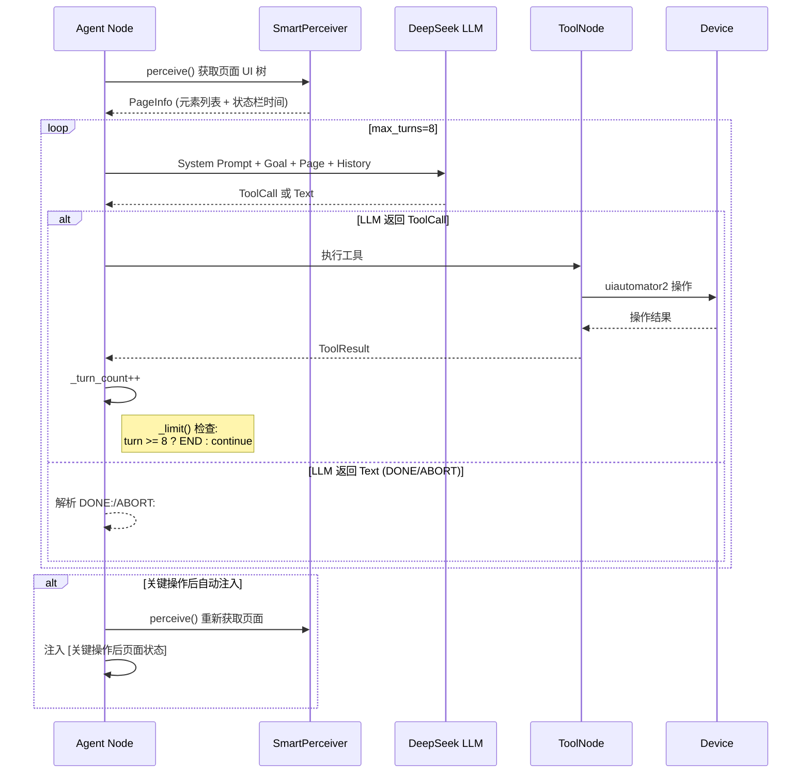
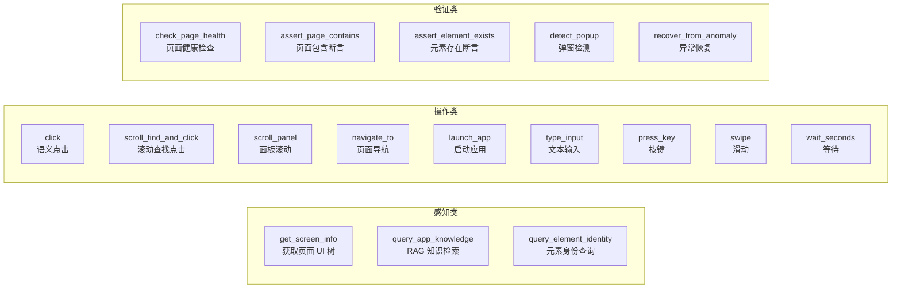
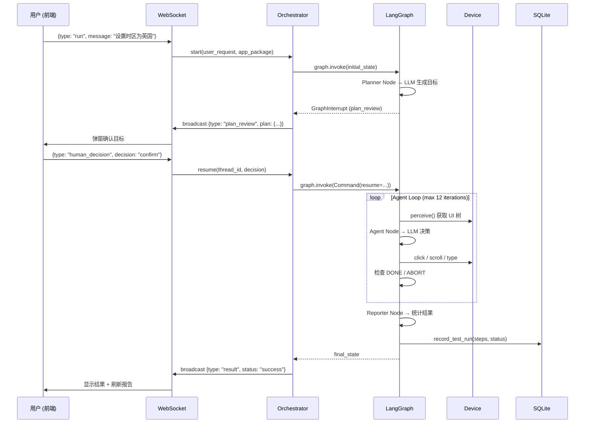
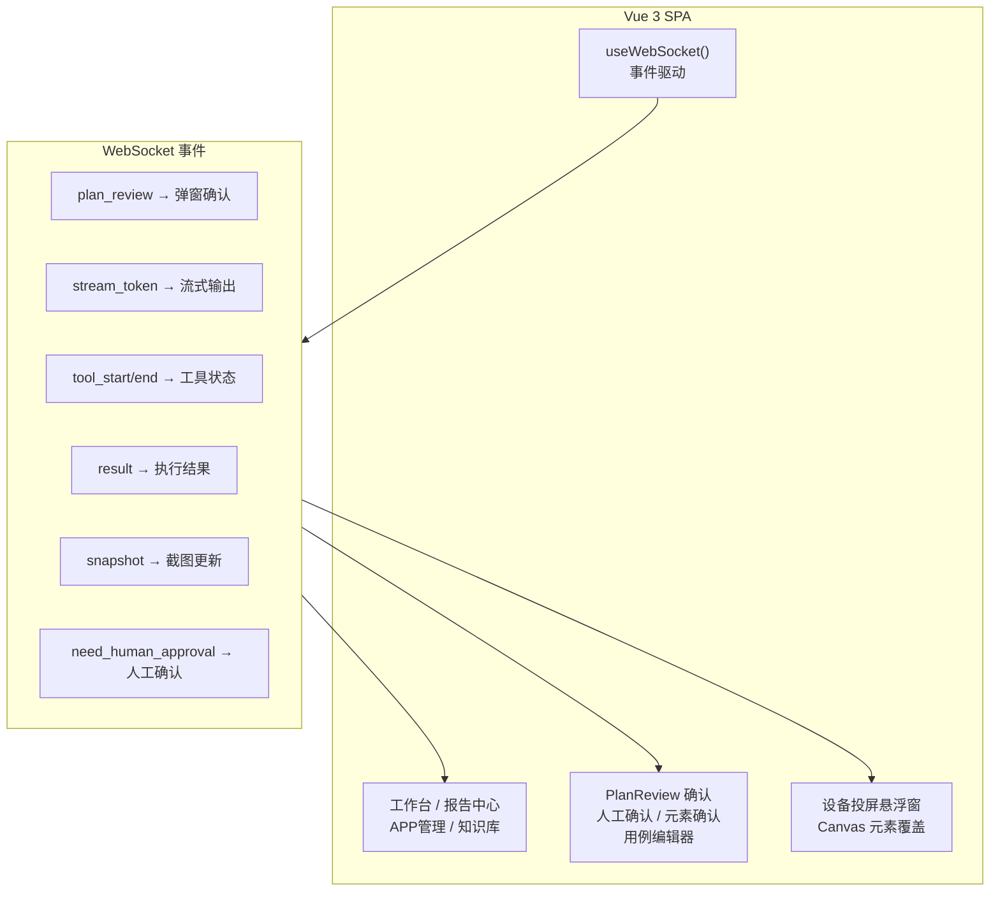

# AI Agent 自动化测试平台 — 架构文档

> 基于 **LangChain + LangGraph** 的 Android UI 自动化测试 Agent

---

## 1. 系统架构总览



---

## 2. LangGraph 状态图 — 核心执行流程



### 2.1 Agent Node 内部流程



---

## 3. LangGraph 关键概念在本项目中的应用

| LangGraph 概念 | 本项目对应 | 文件位置 |
|---------------|-----------|---------|
| **StateGraph** | 测试执行状态机，定义 Planner → PlanReview → Agent → Reporter 节点 | [agents/graph.py:340](agents/graph.py#L340) |
| **State (TypedDict)** | `TestState`: user_request, goal_description, step_history, messages, status | [agents/state.py](agents/state.py) |
| **Command** | 节点返回值，支持 `goto` 路由和 `update` 状态更新 | [agents/graph.py:287](agents/graph.py#L287) |
| **interrupt()** | PlanReview 节点暂停等待用户确认计划 | [agents/graph.py:294](agents/graph.py#L294) |
| **checkpointer (MemorySaver)** | 保存图状态，支持 interrupt 后 resume | [agents/graph.py:351](agents/graph.py#L351) |
| **ToolNode** | Agent 子图中执行工具调用的节点 | [agents/graph.py:96](agents/graph.py#L96) |
| **tools_condition** | 判断 LLM 输出是工具调用还是文本，决定 next node | [agents/graph.py:92](agents/graph.py#L92) |
| **Subgraph (Agent)** | Agent 内部使用独立 StateGraph 管理 tool-calling 循环 | [agents/graph.py:95-99](agents/graph.py#L95-L99) |
| **Command(resume=...)** | 从 interrupt 恢复执行 | [agents/orchestrator.py:192](agents/orchestrator.py#L192) |

---

## 4. LangChain 关键概念在本项目中的应用

| LangChain 概念 | 本项目对应 | 文件位置 |
|---------------|-----------|---------|
| **ChatOpenAI** | 统一的 LLM 调用接口（兼容 DeepSeek） | [agents/graph.py:84](agents/graph.py#L84) |
| **bind_tools()** | 将 17 个 @tool 函数绑定到 LLM，支持 Function Calling | [agents/graph.py:84](agents/graph.py#L84) |
| **SystemMessage / HumanMessage / AIMessage** | 多轮对话消息管理 | [agents/graph.py:214-216](agents/graph.py#L214-L216) |
| **@tool 装饰器** | 将 Python 函数包装为 LLM 可调用的工具 | [tools/__init__.py](tools/__init__.py) |
| **RunnableConfig** | 传递 thread_id / test_config 等上下文 | [agents/graph.py:143](agents/graph.py#L143) |
| **ChromaDB** | 向量存储，RAG 知识检索 | [data/vector_store.py](data/vector_store.py) |
| **HuggingFace Embeddings** | 本地 Embedding (bge-large-zh-v1.5) | [data/vector_store.py](data/vector_store.py) |
| **PromptTemplate** | Planner 的结构化 Prompt | [agents/graph.py:47](agents/graph.py#L47) |

---

## 5. 工具层 (LangChain Tools) — 17 个工具



---

## 6. 数据流 — 一次完整测试的生命周期



---

## 7. 前端架构



---

## 8. 目录结构

```
AiAgentTest/
├── main.py                   # 命令行入口
├── config.py                 # TestConfig 数据类 + YAML 加载
├── config.yaml               # 配置文件
├── agents/
│   ├── graph.py              # ⭐ LangGraph 状态图核心
│   ├── orchestrator.py       # 编排器 (start/resume/stream)
│   ├── state.py              # TestState 定义
│   └── prompts/
│       ├── agent.txt         # Agent System Prompt
│       └── planner.txt       # Planner System Prompt
├── tools/
│   ├── __init__.py           # 17 个 @tool 工具 + ToolContext
│   └── context.py            # ToolContext 数据类
├── api/
│   ├── server.py             # FastAPI + WebSocket
│   ├── websocket_manager.py  # 连接池 + 广播
│   ├── device_routes.py      # 设备 REST API
│   ├── apps_routes.py        # APP 管理 API
│   └── knowledge_routes.py   # 知识库 API
├── device/
│   ├── controller.py         # uiautomator2 封装
│   └── perceiver.py          # SmartPerceiver (UI树/Vision)
├── data/
│   ├── __init__.py           # 工厂函数
│   ├── relational.py         # SQLite (测试记录/元素身份)
│   ├── vector_store.py       # ChromaDB / MemoryBackend
│   └── knowledge.py          # RAG 知识管理
├── llm/
│   └── clients.py            # LLM 客户端 (重试/容错)
├── frontend/spa/src/
│   ├── App.vue               # 主组件 (~1470 行)
│   └── App.css               # 样式
├── storage/                  # 运行时数据
└── docs/                     # 文档
```
