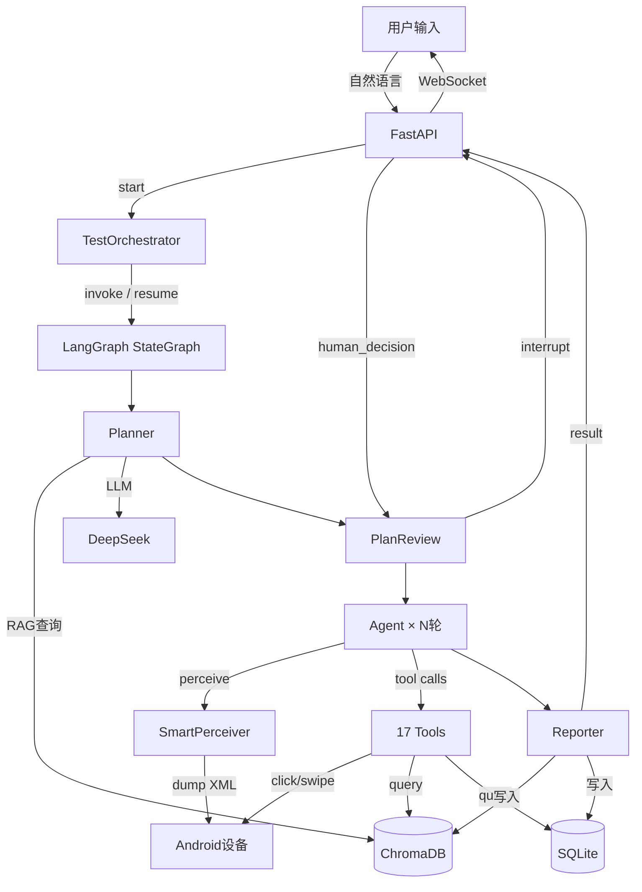
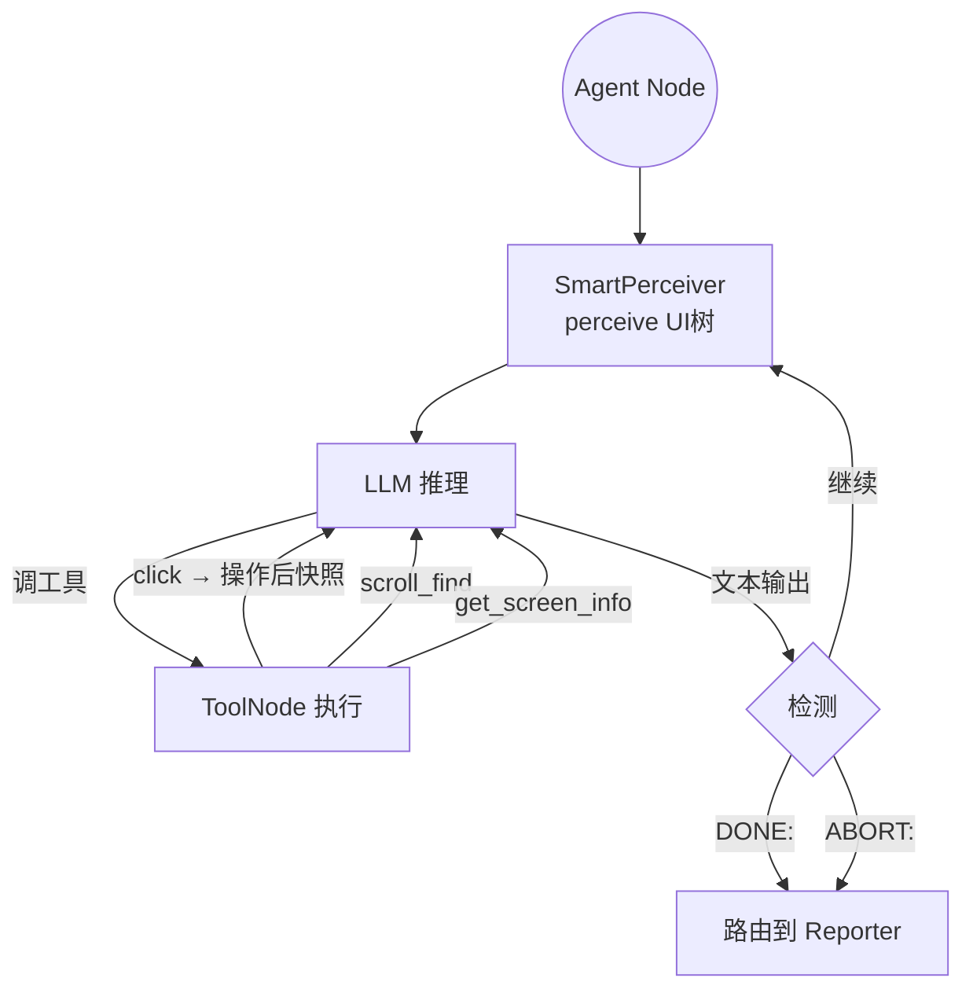
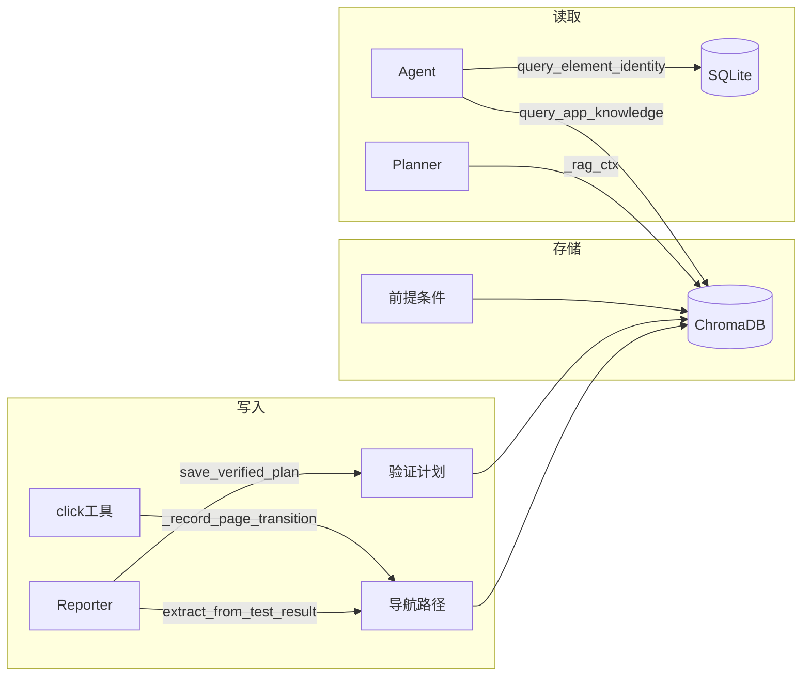
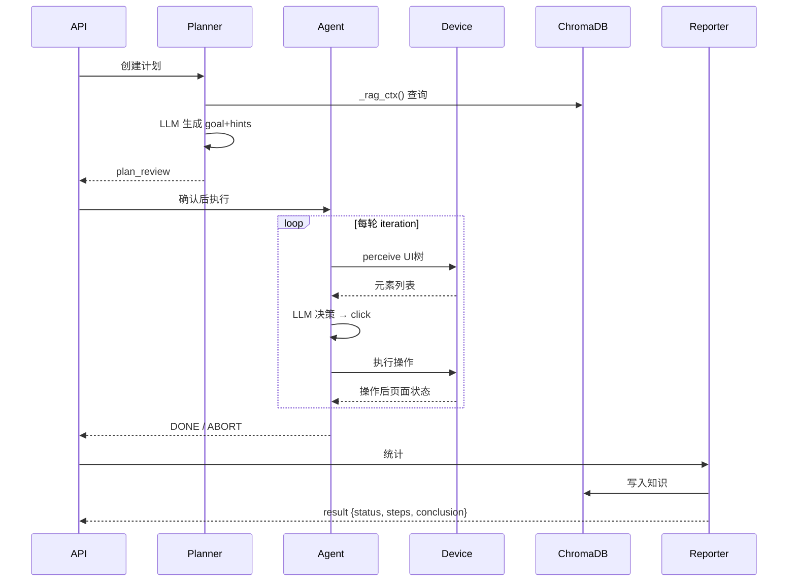
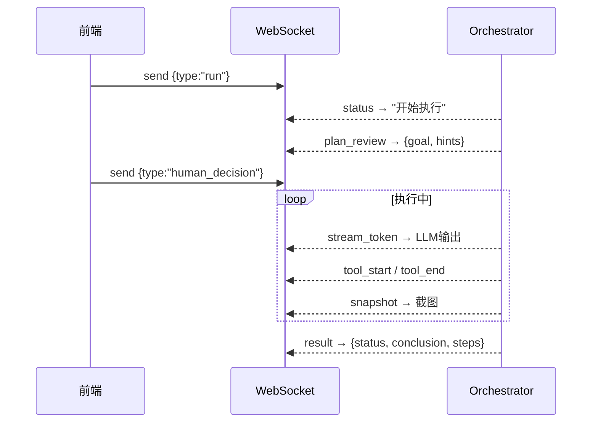

# 系统数据流

## 1. 整体数据流

```mermaid
flowchart TD
    U[用户输入] -->|自然语言| API[FastAPI]
    API -->|start| ORCH[TestOrchestrator]
    ORCH -->|invoke / resume| GRAPH[LangGraph StateGraph]

    GRAPH --> PL[Planner]
    PL -->|RAG查询| KB[(ChromaDB)]
    PL -->|LLM| DS[DeepSeek]

    PL --> PR[PlanReview]
    PR -->|interrupt| API
    API -->|human_decision| PR

    PR --> AG[Agent × N轮]
    AG -->|perceive| SP[SmartPerceiver]
    SP -->|dump XML| DEV[Android设备]
    AG -->|tool calls| TOOLS[17 Tools]
    TOOLS -->|click/swipe| DEV
    TOOLS -->|query| KB
    TOOLS -->|query| SQL[(SQLite)]

    AG --> RP[Reporter]
    RP -->|写入| KB
    RP -->|写入| SQL
    RP -->|result| API
    API -->|WebSocket| U
```

## 2. Agent 执行循环

```mermaid
flowchart TD
    START((Agent Node)) --> PERCEIVE[SmartPerceiver<br/>perceive UI树]
    PERCEIVE --> LLM[LLM 推理]
    LLM -->|调工具| TOOL[ToolNode 执行]
    TOOL -->|click → 操作后快照| LLM
    TOOL -->|scroll_find| LLM
    TOOL -->|get_screen_info| LLM
    LLM -->|文本输出| CHECK{检测}
    CHECK -->|DONE:| RP[路由到 Reporter]
    CHECK -->|ABORT:| RP
    CHECK -->|继续| PERCEIVE
```

## 3. RAG 读写闭环

```mermaid
flowchart LR
    subgraph 写入
        R1[Reporter] -->|extract_from_test_result| W1[导航路径]
        R1 -->|save_verified_plan| W2[验证计划]
        CLK[click工具] -->|_record_page_transition| W1
    end

    subgraph 存储
        W1 --> CHROMA[(ChromaDB)]
        W2 --> CHROMA
        PRECOND[前提条件] --> CHROMA
    end

    subgraph 读取
        PL[Planner] -->|_rag_ctx| CHROMA
        AG[Agent] -->|query_app_knowledge| CHROMA
        AG -->|query_element_identity| SQL[(SQLite)]
    end
```

## 4. 执行时序

```mermaid
sequenceDiagram
    participant API as API
    participant PL as Planner
    participant AG as Agent
    participant DV as Device
    participant KB as ChromaDB
    participant RP as Reporter

    API->>PL: 创建计划
    PL->>KB: _rag_ctx() 查询
    PL->>PL: LLM 生成 goal+hints
    PL-->>API: plan_review

    API->>AG: 确认后执行
    loop 每轮 iteration
        AG->>DV: perceive UI树
        DV-->>AG: 元素列表
        AG->>AG: LLM 决策 → click
        AG->>DV: 执行操作
        DV-->>AG: 操作后页面状态
    end

    AG-->>API: DONE / ABORT

    API->>RP: 统计
    RP->>KB: 写入知识
    RP-->>API: result {status, steps, conclusion}
```

## 5. 前端事件流

```mermaid
sequenceDiagram
    participant FE as 前端
    participant WS as WebSocket
    participant OR as Orchestrator

    FE->>WS: send {type:"run"}
    OR-->>WS: status → "开始执行"
    OR-->>WS: plan_review → {goal, hints}
    FE->>WS: send {type:"human_decision"}
    loop 执行中
        OR-->>WS: stream_token → LLM输出
        OR-->>WS: tool_start / tool_end
        OR-->>WS: snapshot → 截图
    end
    OR-->>WS: result → {status, conclusion, steps}
```
