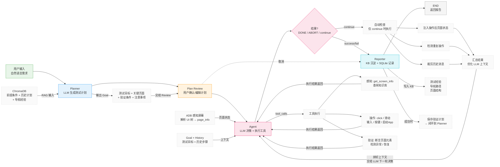

# AI 自动化测试 Agent — 执行流程图

> 从用户输入到最终报告的完整数据流（横屏布局，适合 PPT 展示）。

```mermaid
flowchart LR
    %% ═══ 主流程 ═══
    A["用户输入\n自然语言需求"] --> B["Planner\nLLM 生成测试计划"]
    B --> C["Plan Review\n用户确认/编辑计划"]
    C --> D["Agent\nLLM 决策 + 执行工具"]
    D --> E{"结果?\nDONE / ABORT / continue"}
    E -->|"continue"| D3
    E -->|"success/fail"| F["Reporter\nKB 沉淀 + SQLite 记录"]
    F --> G["END\n返回报告"]

    C -.->|"取消"| F

    %% ═══ Planner 数据流 ═══
    B1["ChromaDB\n前提条件 + 历史计划\n+ 导航经验"] -->|"RAG 输入"| B
    B -->|"输出 Goal"| B2["测试目标 + 关键页面\n+ 验证条件 + 注意事项"]
    B2 -->|"交给 Review"| C

    %% ═══ Agent 数据流 ═══
    D1["ADB 感知屏幕\n解析 UI 树 → page_info"] -->|"页面状态"| D
    D0["Goal + History\n测试目标 + 历史步骤"] -->|"上下文"| D
    D -->|"tool_calls"| D2["工具执行"]
    D2 --> D2a["感知: get_screen_info\n查询知识库"]
    D2 --> D2b["操作: click / 滑动\n输入 / 按键 / 启动App"]
    D2 --> D2c["验证: 断言页面元素\n检测异常 / 恢复"]
    D2a & D2b & D2c -->|"执行结果返回"| D
    D3["自动检查\n仅 continue 时执行"]
    D3 --> D3b["注入操作后页面状态"]
    D3 --> D3c["检测重复操作"]
    D3 --> D3d["裁剪历史消息"]
    D3b & D3c & D3d --> D4["汇总结果\n优化 LLM 上下文"]
    D4 -->|"拼好上下文\n交给 LLM 下一轮决策"| D

    %% ═══ Reporter 数据流 ═══
    F -->|"写入 KB"| F1["测试经验\n导航路径\n页面结构"]
    F -->|"成功时"| F2["保存验证计划\n→ 闭环到 Planner"]

    %% ═══ 样式 ═══
    classDef input fill:#e8f5e9,stroke:#4caf50
    classDef planner fill:#e3f2fd,stroke:#2196f3
    classDef review fill:#fff3e0,stroke:#ff9800
    classDef agent fill:#fce4ec,stroke:#e91e63
    classDef reporter fill:#e0f7fa,stroke:#00bcd4
    classDef endNode fill:#f5f5f5,stroke:#9e9e9e
    classDef detail fill:#fafafa,stroke:#ccc,stroke-dasharray: 3 3

    class A input
    class B planner
    class C review
    class D agent
    class E agent
    class F reporter
    class G endNode
    class B1,B2,D0,D1,D2,D2a,D2b,D2c,D3,D3b,D3c,D3d,D4,F1,F2 detail
```
