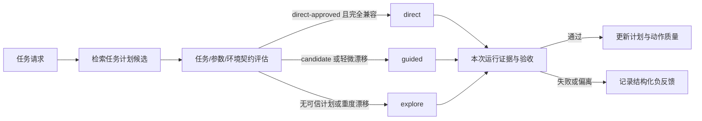
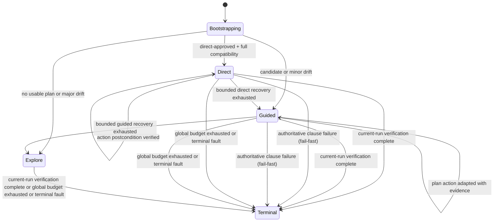

# 统一计划驱动执行与分层知识库重构计划

> 日期：2026-08-13  
> 状态：架构方案待确认  
> 关联问题：相同任务多次探索成功后，后续仍重复大量探索步骤；现有 strict replay 对环境漂移脆弱；RAG 只有页面级片段，无法形成可靠的任务级复用。
>
> **开发阶段决策：不保留 `normal/rerun` 双模式、旧 replay 协议、旧 test case 数据或旧知识库数据的兼容性。允许替换表结构、状态模型、API 和提示词；不编写数据迁移脚本。**
>
> 数据处置边界：可直接删除旧运行记录、旧自动 replay plan、自动生成 `experience` 和旧自动规则；**不得删除人工维护且带 `reviewed_by` 审计信息的 `curated_rule`**。人工规则是不可自动再生的资产，必须在新知识模型中人工分类为 `constraint`、`negative_knowledge` 或 `semantic_hint` 后再启用。
>
> 指导原则：代码只提供有限、稳定的事实与契约（计划版本、适用性、前后置条件、工具结果、证据来源、模式迁移）；LLM 保留对当前页面的理解、计划适用性判断、偏离后的恢复和语义验证决策。本计划不引入针对单个 App/页面的特例规则。

---

## 1. 现象与证据

### 1.1 最新一次探索 run 仍然是“从头探索”

文件：[logs/runs/123731_test-20260813_121510_trace.json](logs/runs/123731_test-20260813_121510_trace.json)

| 指标 | 数值 | 说明 |
|---|---|---|
| `execution_status` | `completed` | 跑完了 |
| `test_verdict` | `passed` | 最终通过 |
| `duration_seconds` | 1313.1 | 约 22 分钟 |
| `step_count` | 103 | 共 103 步 |
| `llm_call_count` | 100 | 100 次 LLM 调用 |
| `rag_query_count` | 2 | 只主动查了 2 次 RAG |
| `script_hit_rate` | 0.0 | 没有复用任何历史脚本 |
| `fuzzy_click_count` | 33 | 当前埋点报告为 33；**暂不能解释为 33 次真正的模糊定位** |

结论：**这是一次没有 direct replay 的 normal run**，虽然最终 passed，但几乎每一步都是 agent 现场决策出来的，没有执行历史成功案例的脚本。它仍可获得页面级 RAG 经验，不能表述为完全没有历史信息。

> 指标校验：`fuzzy_click_count` 当前会把空 label 查询计入 fuzzy match，可能令 index/rid 精确点击也被误计为模糊点击。见 [tools/click.py](../tools/click.py#L852-L859)。因此本计划不以该字段作为当前基线或第一阶段的优化目标；必须先完成指标语义修复并补回归测试。

### 1.2 同一任务已跑过 14 次，成功案例没有被自动复用

所有包含同一请求（`打开联想日历APP后操作 1.新建课程表...`）的 trace 扫描结果：

```text
2026-08-05 10:11  inconclusive  steps=4    llm_calls=4   script_hit=0.5
2026-08-05 13:40  passed        steps=116  llm_calls=114 script_hit=0.0
2026-08-05 13:59  inconclusive  steps=16   llm_calls=3   script_hit=0.8125
2026-08-05 16:21  passed        steps=40   llm_calls=38  script_hit=0.0
2026-08-05 16:31  inconclusive  steps=22   llm_calls=0   script_hit=1.0
2026-08-05 17:41  inconclusive  steps=22   llm_calls=0   script_hit=1.0
2026-08-05 18:20  failed        steps=20   llm_calls=0   script_hit=1.0
2026-08-05 18:57  failed        steps=21   llm_calls=0   script_hit=1.0
2026-08-05 19:05  passed        steps=22   llm_calls=0   script_hit=1.0
2026-08-07 10:51  passed        steps=22   llm_calls=1   script_hit=0.9545
2026-08-12 13:17  passed        steps=54   llm_calls=48  script_hit=0.0
2026-08-12 14:43  passed        steps=58   llm_calls=56  script_hit=0.0
2026-08-12 14:54  inconclusive  steps=31   llm_calls=1   script_hit=0.9677
2026-08-13 12:15  passed        steps=103  llm_calls=100 script_hit=0.0  ← 最新
```

观察：

- `script_hit=1.0` 的几条是 **rerun/direct 回放**，说明历史成功案例已经被提取成过可执行脚本。
- 但这些 rerun 里有 `failed/inconclusive`，说明**直接回放对环境漂移很敏感**。
- 最新一次 `script_hit=0.0`，说明它不是 rerun，**历史成功案例完全没有被加载**。

---

## 2. 根因分析

### 2.1 普通 explore run 不会读取历史 execution_plan

代码中回放开关明确绑定 `rerun`：

- [agents/nodes.py:952](agents/nodes.py#L952)：`replay_enabled = str(state.get("_run_type", "") or "") == "rerun" and bool(replay_actions)`
- [agents/graph.py:58](agents/graph.py#L58)：`if str(state.get("_run_type", "") or "") != "rerun": return False`

只有当 `_run_type == "rerun"` 时，系统才会读取 `goal_description.execution_plan` 并做回放。Explore 模式默认是 `normal`，所以即使数据库里有成功案例，也不会被自动使用。

### 2.2 RAG 只存储“点击级碎片”，不是“任务级计划”

[data/knowledge.py:116](data/knowledge.py#L116) 的 `save_experience` 每次只记录一次页面跳转，例如：

```text
TimetableActivity → click_exact("手动创建课程表") → EditTimetableActivity
```

[tools/click.py](tools/click.py) 在点击成功后调用 `kb.save_experience(...)`，去重粒度是 `(app_package, page_norm, action_label_norm, rid_tail)`。

所以 `query_app_knowledge` 返回的是**零散导航经验**，而不是“这个任务上次是怎么一步步跑通的”。最新 trace 里两次 RAG 查询都没有给出直接可用的完整路径（[trace.json:698](logs/runs/123731_test-20260813_121510_trace.json#L698) 甚至返回了 `TimetableGuideActivity → 我知道了` 这种无关条目）。

### 2.3 成功案例的 execution_plan 没有被自动沉淀

[api/test_cases_routes.py:872-890](api/test_cases_routes.py#L872-L890) 的 `_extract_replay_evidence` 已经能从一次 passed run 中提取 v4 execution_plan，但**只在用户手动“创建用例”或点“复跑”时触发**。普通 explore run 成功后，计划不会自动保存到可被下次 explore 检索到的地方。

### 2.4 环境漂移让回放/探索都不稳定

最新 trace 里 agent 多次被之前跑出来的旧数据干扰：

- [trace.json:188](logs/runs/123731_test-20260813_121510_trace.json#L188)：发现残留表 `"间隔联动测试表"`。
- [trace.json:771](logs/runs/123731_test-20260813_121510_trace.json#L771)、[trace.json:783](logs/runs/123731_test-20260813_121510_trace.json#L783)：agent 专门打开旧表做对比实验，增加约 15 步。
- [trace.json:1056](logs/runs/123731_test-20260813_121510_trace.json#L1056)：因按 back 导致之前的修改被丢弃，需要重做。

没有自动清理 App 数据，导致每次 UI 状态不同，路径也不稳定。

### 2.5 视觉模型不稳定增加探索步数

关键步骤大量依赖 `vision_tap` / `visual_check`：

- [trace.json:1072](logs/runs/123731_test-20260813_121510_trace.json#L1072)：`ERROR: vision 调用失败 Request timed out.`
- step 69-71：第一次 `vision_tap` 点错列（08→11），再修正回来。
- step 91-92：改结束小时时第一次点当前行没反应，第二次才滚到目标值。

这些视觉步骤不仅拖慢探索，也让回放脚本里的验证证据容易变成 `unknown`，导致 rerun 直接失败或 inconclusive。

### 2.6 上下文治理仍有压力，但不是“只有粗裁剪”

- [config.yaml:8](config.yaml#L8) `context_history_steps: 5`
- [agents/nodes.py](../agents/nodes.py#L2069-L2118) 会先折叠历史 `get_screen_info` 大输出，再默认保留 14 条消息。

当前实现已减轻旧屏幕快照的积累，但长任务中高频屏幕信息、反复感知和 100 次 LLM 调用仍会增加延迟，并使早期路径信息更难被持续有效利用。该问题是性能与上下文生命周期治理问题，不应简单归因为“LLM 忘记”。

### 2.7 运行基础设施的两个先决缺口

这些问题不是任务级复用设计本身，却会污染后续效果判断，应先完成或与 PoC 同步完成。

1. **click 冷却未闭环。** [agents/loop_control.py](../agents/loop_control.py#L42-L56) 对 `click` 计算了文本但未返回冷却分组键；执行层因而无法按目标抑制重复 click。它会放大“探索 -> back -> 再探索”的通用空转，应修成稳定的 `tool + normalized target + page signature` 契约，并为其添加单元测试。
2. **环境数据没有 lifecycle 契约。** [agents/orchestrator.py](../agents/orchestrator.py#L21-L49) 会重置 run 级内存状态，但不会处理 App 内测试实体。最新 trace 的残留课程表已证明业务数据会改变决策空间。不能默认清空 App 数据；应通过 run profile、唯一资源名、fixture 指纹和可回收 cleanup 建立可比较的测试前置条件。

### 2.8 验收 oracle 不能被历史经验放宽

最新 run 的最终证据显示时间文字为红色、小节数量为黑色，却以“按 RAG 的 App 行为正常”为由把复合验收项报为 `passed`。见 [123731 trace](../logs/runs/123731_test-20260813_121510_trace.json#L1508) 和 [最终断言](../logs/runs/123731_test-20260813_121510_trace.json#L1546)。

这不是 RAG 召回失败，而是验收契约被历史经验覆盖。通用规则应为：**RAG 可提供行动建议和解释，但不得放宽 `goal.verification` 的显式条件；证据与验收条件冲突时，至少降级为 `unknown/review_required`，不能判 `passed`。**

---

## 3. 目标架构

不再区分“首次探索”与“复跑脚本”。每次任务都是一次**计划驱动执行**：先检索和评估任务级计划，再根据计划可信度与当前环境选择执行策略。



### 3.1 统一状态机

只保留一个执行入口和以下有限状态：`Bootstrapping`、`Direct`、`Guided`、`Explore`、`Terminal`。

| 执行策略 | 启动条件 | 下一步决策 | 作用 |
|---|---|---|---|
| `direct` | direct-approved plan，任务参数、验收语义与环境完全兼容 | 代码按当前步骤执行 | 快速、低 LLM 调用、可审计 |
| `guided` | candidate plan，或 trusted plan 存在轻度环境漂移 | LLM 根据计划摘要适配 | 利用历史路径但保留应变 |
| `explore` | 无计划、参数/验收不兼容、重度漂移 | LLM 自由探索 | 最终恢复能力 |

状态迁移由代码根据可判定事实触发并记录原因：



`direct` 的 recovery 耗尽只表示 direct 阶段耗尽，允许单次、可审计地降到 guided；guided 阶段耗尽允许单次降到 explore；只有全局预算、设备不可用、用户停止或明确安全阻断才能终止整个任务。禁止状态来回摆动或隐式重置步骤索引。

降级是单向的：进入 guided 后即使重新对齐计划，也不回到 direct；进入 explore 后不回到 guided/direct。这个取舍牺牲局部速度，换取无振荡、可证明的状态机行为。

### 3.2 不变量

1. 每个可推进动作都必须记录本次运行的 `status_code`、结构化 evidence 与页面变化或明确后置条件。
2. 所有执行策略共享同一个 `goal.verification`；计划完成度、历史通过率、RAG 解释均不能代替本次验收证据。
3. `passed` 当且仅当全部显式验收项有充分的本次运行证据：

$$
P_{\text{passed}} \iff \bigwedge_{i=1}^{n}\text{verification}_i\text{ has sufficient current-run evidence}
$$

4. 计划和动作只能通过结构化质量统计升降级；LLM 不能自行提高可信度。
5. 每次模式切换必须写入 `from_mode`、`to_mode`、`reason`、已消耗阶段预算和关联 plan/action id。

---

## 4. 统一计划与分层知识库

### 4.1 新数据模型

废弃旧 `test_cases` / `execution_plan` / `normal-rerun` 绑定模型，建立权威关系表 `execution_plans` 与 `plan_actions`。旧数据可直接丢弃。

```json
{
  "plan_id": "plan_xxx",
  "task_signature": {
    "app_package": "com.example.app",
    "action_semantics": ["新建课程表", "设置时长", "验证冲突提示"],
    "verification_semantics": ["时长设置生效", "冲突状态可观察", "保存被拦截"],
    "parameter_slots": {"lesson_duration": "50分钟", "break_duration": "10分钟"}
  },
  "entry_contract": {"activity": "TimetableActivity", "fixture_fingerprint": "..."},
  "quality": {"trust": "candidate", "attempt_count": 0, "success_count": 0}
}
```

任务匹配键必须包含 `app_package + 动作语义 + 验收语义 + 关键参数槽位`。不能为了“归一化”删除改变行为或验收的参数，例如 50 分钟和 53 分钟。

环境兼容键最小包含：`app_version + screen_profile + entry_activity + fixture_fingerprint`。同一 plan 只有在至少两个独立通过 run 的兼容键相同、且关键参数和验收语义一致后，才能从 `candidate` 升为 `trusted`。

“独立通过 run”定义为：不同 `run_id`、不同执行会话、均完成本次验收、且不复用对方运行时状态；同一环境兼容键只计一次独立样本。是否要求不同日期或不同设备不作为信任晋升条件；设备变化由环境兼容键自然隔离。

`trusted` 只解锁 guided，不自动解锁 direct。direct 准入还需满足：人工 `direct_approved=true`、同一兼容键下连续 $N$ 次 guided 全动作对齐、每个 action 的 postcondition 通过率和 quality 均不低于配置阈值。人工可随时撤销 direct approval；任何 action 出现权威后置条件失败时，撤销该 plan 的 direct eligibility。

对齐由确定性函数判定，而非 LLM 自报：

```python
evaluate_action_alignment(plan_action: PlanAction, event: ActionEvent) -> AlignmentResult
```

只有 `tool` 相同、参数槽位归一化后相等、event 的 `page_before` 满足 plan `precondition`、实时 locator 与 action locator 可兼容、且 event 后置证据满足 plan `postcondition` 时为 `aligned`。任一关键事实缺失为 `unknown`，不能计入连续全动作对齐；不兼容为 `deviated`，记录可枚举 `deviation_reason`。

### 4.2 四层知识职责

| 层 | 内容 | 权威来源 | 用途 |
|---|---|---|---|
| `TaskPlan` | 任务签名、入口契约、动作序列、plan 质量 | 关系库 `execution_plans` | 选择 direct/guided/explore |
| `ActionKnowledge` | 动作前后置条件、locator、成功/失败统计 | 关系库 `plan_actions` | direct 推进、guided 恢复 |
| `LocatorKnowledge` | 当前页元素身份、rid/class/path、实时匹配 | 关系库 + 当前 UI 树 | 当前页候选，不能绕过实时感知 |
| `SemanticKnowledge` | 业务规则、页面解释、经验与限制 | 向量库 | 供 LLM 理解，不授权执行 |

语义 RAG 与验收判定严格隔离：语义 RAG 不能覆盖验收判定。

### 4.3 RAG 重构

废弃“自动注入一套文本、工具查询另一套文本”的双通道。建立单一结构化入口：

```python
retrieve_knowledge(app_package, query, page_signature, purpose)
```

`purpose` 只能取 `task_plan`、`action`、`locator`、`semantic`。返回带来源、置信度、适用条件、动作和后置条件的结构化候选；不再让 LLM 从混合 Markdown 中猜哪些内容能执行。

- 向量库新增 `task_plan_summary`，只保存 plan 摘要、匹配语义和 `plan_id`；完整计划只从关系库读取。
- 旧 `experience` 不再承担任务级计划；它只存页面级动作知识，并新增正负反馈。
- 人工 `curated_rule` 重构为 `constraint`、`negative_knowledge`、`semantic_hint`。只导入已人工分类的规则；未分类规则处于 quarantine，不能自动参与运行。只有 `constraint` 可参与代码流程；任何 rule 都不得覆盖 `goal.verification`。

### 4.4 动作质量与视觉负反馈

每个 `plan_action` 记录 `attempt_count`、`success_count`、`not_found_count`、`postcondition_pass_count`、`timeout_count`、`postcondition_failure_count`、`last_failed_at`、`quality_score`。

可靠性采用平滑计算，避免一次成功即高可信：

$$
reliability = \frac{success\_count + 1}{attempt\_count + 2}
$$

`quality_score` 不是 reliability 的别名。它按近期可靠性、后置条件可信度和失败惩罚合成：

$$
quality = clamp_{[0,1]}(reliability \times postcondition\_rate \times e^{-\lambda \cdot age} - 0.25 \times timeout\_rate - 0.35 \times not\_found\_rate)
$$

其中所有 rate 统一采用 Laplace 平滑：$rate=(count+1)/(attempt\_count+2)$；$postcondition\_rate=(postcondition\_pass\_count+1)/(attempt\_count+2)$，$age$ 是最近成功验证后经过的天数，$\lambda$ 为可配置衰减常数。阈值不写死在代码，须由 Phase 4 基线数据确定。

视觉超时、误点列、后置条件失败作为 per-action 负反馈；一次失败仅降权，不永久报废计划。滚轮等控件若无可信的值通道，不能假装已完成后置验证，应从 direct 降到 guided 并保留 LLM + 视觉判断。

---

## 5. 运行时设计

### 5.1 启动与模式选择

每次运行执行：解析任务目标与验收 -> 检索 task plan -> 比对参数/验收/环境契约 -> 选择 `direct`、`guided` 或 `explore`。

- `direct`：仅已获 direct approval 的 plan 可进入；执行当前 action，只有可验证的后置条件满足才推进。
- `guided`：候选摘要作为常驻上下文，LLM 决定采用、适配或拒绝；实际执行日志用于确定性计算计划采纳/偏离，而非依赖 LLM 自报。
- `explore`：不再展示不适用的计划，保留全局验收与循环/预算契约。

计划摘要必须在 state 中常驻，且在每轮重建或被消息裁剪白名单保留。只常驻 `plan_id`、当前建议动作、前置条件、参数槽位和“不可放宽验收”约束，不能持续堆积完整历史脚本。

### 5.2 判定与证据

确定性检查必须显式携带 `verification_key`，以 key 精确关联，废弃双向子串匹配。验证项需要结构化“验收子条件 -> 本次证据”映射。

当 agent 上报 `passed` 但证据承认某验收子条件未满足时，判定层必须输出 `unknown + review_required`；不得依赖“按 RAG 正常”等关键字黑名单，也不得允许历史计划填补本次缺失证据。

### 5.3 验收子条件与充分证据模型

这是最终 verdict 的权威机制，不能再由 LLM 的自由文本 `detail` 隐式决定。

#### 5.3.1 结构化验收合同

planner 必须输出结构化 `verification_contract`；每个验收项由有限子条件组成，并声明允许的证据通道：

```json
{
  "key": "v4",
  "statement": "冲突时显示错误并阻止保存",
  "clauses": [
    {"id": "v4.color", "claim": "时间文本为红色", "channels": ["vision_verify"]},
    {"id": "v4.toast", "claim": "出现冲突提示", "channels": ["ui_text", "click_and_check"]},
    {"id": "v4.blocked", "claim": "保存被拦截", "channels": ["page_state", "behavior_effect"]}
  ]
}
```

验收合同必须保留可审计的三级来源链：`user_request -> goal.verification -> clauses`。planner 从用户原始请求抽取每个 `goal.verification` 时，为 goal 记录 `request_source_span`；再将该 goal 分解为 clauses，并为每个 clause 记录 `goal_source_span`。用户指定的每个可辨识并列条件都必须成为至少一个 goal 和至少一个 clause；合同生成器同时输出 `coverage_map`，标明每个条件 span 对应的 goal 与 clause。

coverage span 分为 `condition` 与 `context`。`context` 显式记录编号、导语、连接词等不构成可验证条件的脚手架，不能映射为 clause；机器只要求每一层的 condition span 无 gap、无非法重叠地覆盖其上层对应的 condition span，而不要求整段自然语言原文被 clause 平铺。

机器只能验证跨度拓扑，不能证明 `request_source_span -> goal` 或 `goal_source_span -> clause claim` 的语义确实等价，例如整句被归给“时间为红色”但遗漏“小节数为红色”的情况。因此所有新生成或修改过的 contract，包括首次 explore，都先进入 `contract_pending_review`，不能执行；plan review UI 必须同时展示用户原始请求、goal.verification（含 request source span）、clauses（含 goal source span）、通道与覆盖状态。人工确认两级语义真实覆盖后才生成可运行 plan。确认可被显式拒绝或退回修改，不能静默跳过。这样 planner 在请求到 goal 或 goal 到 clause 任一阶段的静默漏拆都不能绕过 evaluator，代价是首次任务存在一次人工确认门槛。

#### 5.3.2 证据事件与判定函数

工具不再只写自由文本，而是追加本次 run 的 typed `EvidenceEvent`：

| 通道 | 典型来源 | 何时可证明 |
|---|---|---|
| `ui_text` | `assert_page_contains`、UI 树 | 当前页出现目标文本，PASS 是权威事实 |
| `element_state` | 元素属性、开关/输入值 | 当前 UI 树直接给出目标状态 |
| `vision_verify` | `visual_check`、`vision_tap.verify` | 模型返回结构化 `decision=yes`，并带截图/观察时间 |
| `click_and_check` | 点击后的视觉/Toast 检查 | 本次点击与正向检查共同成立 |
| `page_state` | 页面/Activity/可观察状态变化 | 动作后仍在目标页面或进入明确目标状态 |
| `behavior_effect` | 保存被拦截、列表未变化等行为 | 前后状态差异满足已声明效果 |

每个 event 至少包含：`run_id`、`verification_key`、`clause_id`、`channel`、`status`、`tool_call_id`、`timestamp`、`artifact_ref`、`fact`。`assert_verification` 改为引用 clause evidence，而不是直接接受 LLM 给出的最终结果。

判定函数签名：

```python
evaluate_verification(contract: VerificationContract, events: list[EvidenceEvent]) -> VerificationResult
```

事件生产责任：`assert_page_contains`/元素状态工具生产 `ui_text`/`element_state`；`visual_check` 与 `vision_tap.verify` 生产 `vision_verify`；`click_and_check` 生产同一 tool call 关联的 `click_and_check`；框架在每次工具前后快照时生产 `page_state`；新增 `assert_behavior_effect(before, after, expected)` 工具生产 `behavior_effect`。没有生产者的通道不可在 contract 中声明。

`behavior_effect.expected` 第一版只允许有限 DSL：`still_on_activity(activity)`、`no_page_change(page_fingerprint)`、`list_count_unchanged(list_anchor)`、`element_present(locator)` 与 `element_absent(locator)`；**后续 phase4 增补 `toggled(label,on|off)`**（读实时 `checked`，属当前态检查，非 before/after 比较）。每个谓词必须绑定稳定 anchor、before/after artifact 和比较范围。**`authoritative` 判定规则（确定性不变量）**：`authoritative=True` 仅授予确定性 before/after 反证（`still_on_activity`/`no_page_change`/`list_count_unchanged`）；`authoritative=False`（默认 unknown，可重试）授予所有当前态检查谓词（`element_present`/`element_absent`/`toggled`）——因为实时/瞬态读取在过渡期不可靠，其 FAIL 可能是过渡态误报，不能触发 fail-fast。只有这些 DSL 谓词实现了确定性 before/after 比较时，`behavior_effect` 的 FAIL 才是权威反证；其他自然语言效果说明只能产生 unknown，不能进入权威证据路径。

反证语义是通道特定的：`behavior_effect` 中仅确定性 before/after 谓词（`still_on_activity`/`no_page_change`/`list_count_unchanged`）的 FAIL 可作为权威反证；当前态检查谓词（`element_present`/`element_absent`/`toggled`）的 FAIL 默认产生 unknown（可重试，不触发 fail-fast）；`page_state` 仅 FAIL + 显式 `package/activity` 时权威；`vision_verify=no` 仅在截图完整、目标区域可见且模型返回高置信反证时才可失败（此时权威），否则 unknown。一个 verification 只有所有 clause 通过才可 passed；任一 clause failed（仅来自 `authoritative=True` 的 FAIL）则 failed；其余为 unknown + review_required。历史 plan、RAG、旧截图和 LLM `detail` 只能附加解释，不能作为 clause 证据。


### 5.4 Evaluator 节点与终止契约

evaluator 分为两个层次，避免假设一个工具调用等于一个 graph step：工具执行层的 `evidence_collector` 在 `_run_agent` 内每个工具调用返回后同步写入 `EvidenceEvent` 并调用 `evaluate_verification` 更新 `clause_state`；若 verdict 已 terminal，`_run_agent` 必须中断同一轮剩余 `max_turns`，不再继续调用工具。

graph 层保留无 LLM 的 `evaluator_node`，但它只在 agent 一轮返回后读取聚合的 `clause_state` 与 terminal request，并做路由裁决：全部 clauses 通过路由到 reporter；任一 clause 失败、已确认 abort 或终止故障路由到 reporter；其他情况回到当前 execution mode。权威 clause failure 是有意的 fail-fast：立即结束 run，不继续收集其余 clauses 的完整结果；最终报告必须标识 `terminated_on_authoritative_failure` 与尚未评估的 clauses。这样 clause 状态的粒度是每工具调用，graph 路由的粒度仍是一轮 agent 执行。

删除旧 `route_after_agent` 基于 LLM 自报结果的全过判断。保留最小工具 `terminate_run(reason)` 供 agent 在明确无法继续时请求 abort；该调用只产生 `agent_abort_requested` 事件，由 evaluator/状态机确认并以可解释 `Terminal` 原因结束，不能自行给出 passed。

**`authoritative` 标签语义约束（fail-fast 的准入门槛）**：fail-fast 只应由**确定性已稳定**的反证触发，`authoritative=True` 的授予必须收敛，不可泛化。
- **`authoritative=True`**：仅授予「前后对比、状态已被框架确认稳定」的反证，典型如 `still_on_activity` / `list_count_unchanged` 这类确定性谓词。这类 FAIL 才是真·权威失败，立即终止 run。
- **`authoritative=False`（默认 unknown，可重试）**：读实时/瞬态状态的谓词（如 `element_present`、`element_absent`、`toggled(WLAN,on)`）其 FAIL **默认不授权**，因为它可能是过渡态（开关尚未稳定、页面刚切换、元素刚加载）。除非框架能证明状态已稳定（如稳定等待后二次回读一致），否则不应标 `authoritative=True`。
- 这一约束保证 §5.4 的 fail-fast 不变量**只杀真·权威失败**，而「过渡态误报」回落为 unknown，agent 仍可重试 / 换方式 / abort，不触发过早终止。当前 `assert_behavior_effect` 对所有结果一律 `authoritative=True` 违反本约束，需收紧（详见 Gap Plan P0 第 3 点）。

### 5.5 观测与预算

trace 采用新 schema，至少记录：

- `execution_mode`、`mode_transition_events`、`plan_id`、`plan_trust`；
- `plan_match_decision`、`plan_action_alignment`、`deviation_reason`；
- 每类后置条件通道的命中率：`ui_text`、`vision_verify`、`deferred_assert`；
- direct/guided/explore 的阶段预算、全局预算与耗尽原因；
- `exact_resolution_count`、`semantic_resolution_count`、`label_mismatch_count`。

`match_mode` 表示定位路径，`label_mismatch` 表示请求 label 与命中 label 的差异，二者为正交维度；修复空 label 被计为 mismatch 的问题，但不强行把两个指标设为互斥。

`execution_mode` 的枚举只包含 `direct`、`guided`、`explore`；`Bootstrapping` 与 `Terminal` 是状态机生命周期阶段，记录为 `lifecycle_state`，不混入执行策略指标。

### 5.6 知识查询的调用面

`retrieve_knowledge` 是内部服务，不把通用的 `purpose` 枚举直接暴露给 LLM：

- `Bootstrapping` 固定调用 `task_plan`，用于选择 execution mode。
- `direct` 不调用语义 RAG；只读取已选 plan 的当前 action 和实时 locator 校验结果。
- `guided` 每轮由框架提供当前 plan action 摘要；LLM 可调用受限工具 `request_knowledge(intent)`，框架根据当前页面与 mode 映射到 `action`、`locator` 或 `semantic`。
- `explore` 可调用同一个受限工具；它返回不超过有限数量的结构化候选，而不是整库 Markdown。

删除 `query_app_knowledge`，以 `request_knowledge(intent)` 取代。`report_done` 删除，由 evaluator 在所有 verification contract 满足时终止；验证工具改为产生 `EvidenceEvent`，不再由 `assert_verification(condition, result, detail)` 直接决定 verdict。

### 5.7 成功 run 到计划的提取算法

只有 evaluator 判为 passed、contract 已人工确认、且本次 run 未处于 `contract_pending_review` 时，运行记录才可沉淀为 plan。

1. `run_recorder` 在每个工具调用后持久化 `ActionEvent`：tool、规范化输入、实时 locator、page before/after、关联 EvidenceEvent、status、mode 和时间。
2. `plan_extractor` 读取按时间排序的 `ActionEvent[]`，剔除失败、取消回退、无进展循环、仅诊断读取和已标记 dead-end 的动作。
3. 每个保留动作生成 `plan_action`：`precondition` 来自前一有效动作后的稳定 `page_state` 与 required locator anchors；`tool_input` 取参数槽位化后的输入；`locator` 取本次 `resolved_target` 与实时 UI 交集，不能仅录 index；`postcondition` 取该动作之后、下一个业务动作之前关联的权威 `EvidenceEvent` 与 page delta，无法证明则标记 `deferred`；`verification_links` 记录它为哪些 clause 产生证据。
4. extractor 生成 candidate plan，并将每个 action 标记为 `direct_eligible`、`guided_only` 或 `excluded`。视觉不确定、deferred assertion、依赖语义推断的 action 默认 `guided_only`。
5. evaluator 校验提取结果：每个 contract clause 至少有本次证据链；每个 direct-eligible action 有可复验 precondition/postcondition；失败则只保留 run，不创建 plan。

计划提取是确定性离线/后置流程，不在 reporter 内手工拼装状态，也不依赖旧 `_extract_replay_evidence`。

---

## 6. 替换范围

| 当前模块 | 替换目标 |
|---|---|
| `test_cases` / `execution_plan` / `run_type` | `execution_plans`、`plan_actions`、统一 `execution_mode` 状态机 |
| strict replay agent 与 normal agent | 单一 agent prompt，按当前 mode 注入事实与计划摘要 |
| replay-only recovery | direct -> guided -> explore 的分阶段预算和可审计迁移 |
| 自动 RAG / `query_app_knowledge` 双通道 | `retrieve_knowledge(..., purpose)` 单一结构化入口 |
| experience 只有成功片段 | 页面级动作知识 + 正负反馈与质量统计 |
| `element_identities` | 替换为 `locator_knowledge`，统一归属 `LocatorKnowledge`；删除旧 API 与旧表，避免双写 |
| 旧 trace、自动经验和自动规则 | 可直接清空并按新 schema 重建，不做迁移；人工 curated rule 先分类导入 |

预期主要改动：`data/relational.py`、`data/knowledge.py`、`data/vector_store.py`、`agents/state.py`、`agents/graph.py`、`agents/nodes.py`、`agents/orchestrator.py`、`agents/rag_context.py`、`tools/knowledge_tools.py`、`tools/verify.py`、`agents/verification.py`、相关 API/前端路由与测试。

API/前端采用硬切换：先冻结新 REST/WebSocket 事件契约，再在同一发布中替换后端路由和前端消费端；旧 `/api/test_cases`、rerun 消息和相关 UI 入口一并删除。开发环境可接受切换窗口内旧前端不可用，不维护双协议。

---

## 7. 分阶段实施与验收

### Phase 1：重建事实契约与数据模型

1. 删除旧 run type、旧 replay plan、旧自动知识和旧 API；建立 `execution_plans`、`plan_actions`、`locator_knowledge`、新的 run/trace schema。人工 curated rule 先完成分类导入后才删除旧库；提供规则清单导出和分类辅助页/脚本，记录 reviewer、分类、理由与 quarantine 状态。
2. 实现统一状态枚举、模式迁移事件、阶段预算和全局预算。
3. 修复 click cooldown；重新定义定位路径、label mismatch 与 recovery 指标。
4. 实现 verification contract、verification key 精确关联、typed EvidenceEvent 和验收子条件证据映射。

验收：状态机非法迁移不可达；trace 与数据库统计可相互推导；请求到 goal 或 goal 到 clause 的 condition 覆盖有 gap/非法重叠、或尚未完成人工两级语义确认的 contract 不能开始首次 explore；缺少任一验收子条件时不可能产生 `passed`；人工规则已全部分类或显式 quarantine。

### Phase 2：实现分层知识与 Guided

1. 落地 `retrieve_knowledge(..., purpose)`、task plan summary 向量索引和关系库 plan 权威读取。
2. 实现任务参数、验收语义与环境 fingerprint 门控。
3. 实现 guided 上下文常驻、计划采纳/偏离的确定性日志比对。
4. 成功 run 经 `ActionEvent -> plan_extractor -> plan_actions` 自动创建/更新 candidate plan；candidate/trusted 质量模型生效。

验收：同任务兼容环境的第二次运行能检索并使用 plan；参数或验收不兼容时拒绝候选；长任务不会丢失最小计划摘要；新前后端均只调用新 API/WebSocket 契约。

### Phase 3：实现 Direct 与受控降级

1. 仅 direct-approved + 全兼容环境进入 direct。
2. direct 步骤后置条件失败或 direct 阶段预算耗尽时，单次降级到 guided。
3. guided 阶段预算耗尽时，单次降级到 explore；全局预算耗尽才终止。
4. 落地 per-action 视觉负反馈和质量衰减。

验收：direct happy path 的 LLM 调用显著低于 guided；轻度漂移更多进入 guided 而非硬 abort；重度漂移进入 explore 或给出明确终止原因；三种模式的 verdict 均只依赖本次证据。

### Phase 4：端到端性能与质量门禁

1. 按模式统计通过率、耗时、LLM 调用、模式转换、后置条件命中与证据完整率。
2. 建立回归集：兼容环境、轻度漂移、重度漂移、参数不兼容、视觉超时、验收冲突。
3. 采用差分测试与证据篡改测试，确保任何模式都不能通过历史内容伪造 `passed`。
4. 明确冷启动基线：重构上线后自动经验被清空，前若干 run 的效率可能低于旧系统；只以新 schema 冷启动后的分阶段基线评估，不把短期回落误判为架构失败。

---

## 8. 成功指标与 Review 决策

| 指标 | 目标 |
|---|---|
| `current_evidence_coverage_rate` | 所有 passed run 为 100% |
| `plan_match_precision` | 参数、验收、环境均兼容的候选才允许 guided/direct |
| `direct_to_guided_rate` | 可观测并按 plan/action 定位原因 |
| `guided_to_explore_rate` | 可观测并按环境/知识缺口定位原因 |
| `plan_action_postcondition_rate` | trusted action 保持高水平，阈值由基线确定 |
| `llm_call_count` / `duration_seconds` | direct < guided < explore 的分位数可解释 |
| `false_pass_count` | 0；验收冲突必须降级 |

Review 需确认：

1. 是否接受直接替换旧 normal/rerun/replay 模型与旧数据，而非兼容迁移？
2. 是否接受 `execution_plans` 成为唯一任务级计划权威，向量库只保存摘要索引？
3. 是否接受 `direct -> guided -> explore` 是唯一允许的降级方向，且阶段降级次数有限？
4. 是否接受所有模式都以本次运行验收证据判定结果，历史知识永不覆盖验收？
