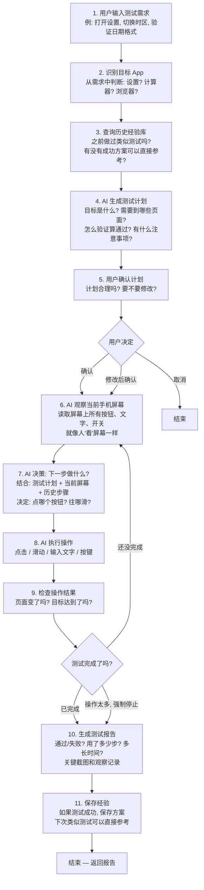

# AI 自动化测试 Agent — 框架简介

> 用通俗语言解释：你输入一句话的测试需求，AI 如何自动完成测试并给出结果。

---

## 一句话概括

**你说需求 → AI 制定计划 → 你确认 → AI 操作手机 → AI 汇报结果**

---

## 完整流程图



---

## 每个阶段做了什么

| 阶段 | 做什么 | 类比 |
|------|--------|------|
| 识别 App | 从你的需求中判断要测哪个 App | 你说"打开设置"→ 我知道是系统设置 App |
| 查历史经验 | 查知识库有没有类似测试的成功记录 | 像老员工查以前怎么做的 |
| 生成计划 | AI 分析需求，输出：目标、关键页面、验证条件、注意事项 | 像测试经理写测试方案的摘要 |
| 用户确认 | 暂停，让你看一眼计划是否合理 | 像方案审批 |
| 观察屏幕 | 读取手机当前页面的所有元素 | 像人看屏幕，但读的是结构化数据 |
| AI 决策 | 根据计划 + 当前屏幕，决定下一步操作 | 像测试人员思考"接下来点哪里" |
| 执行操作 | 真正去点击/滑动/输入 | 像人用手指操作手机 |
| 检查结果 | 操作后重新看屏幕，判断是否达成目标 | 像人确认"我要的效果出来了吗" |
| 生成报告 | 汇总所有步骤，给出通过/失败结论 | 像测试人员写测试报告 |
| 保存经验 | 成功的方案存入知识库 | 像老员工把经验传给新人 |

---

## 核心能力

| 能力 | 说明 |
|------|------|
| **知识积累** | 每次成功测试都会保存方案，下次同 App 测试更快更准 |
| **自动验证** | 不只操作，还会自动判断"测试是否通过" |
| **防循环** | 检测到重复操作会自动提醒，避免死循环 |
| **人在回路** | 关键节点（计划确认）可以人工介入 |

---

## 技术架构一览（简化版）

```
用户 → 编排器(Orchestrator) → LangGraph 状态图
                                    │
                    ┌───────────────┼───────────────┐
                    ▼               ▼               ▼
              规划专家          执行 Agent         报告生成
           (Planner)         (Agent)           (Reporter)
              │               │    ↑              │
              │          ┌────┘    │              │
              │          │  工具层  │              │
              │          │ 点击/滑动/查询知识库    │
              │          └─────────┘              │
              │                                   │
              └──── 知识库(ChromaDB) ──────────────┘
                    存储: 页面结构/导航路径/成功方案
```
