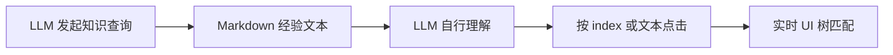
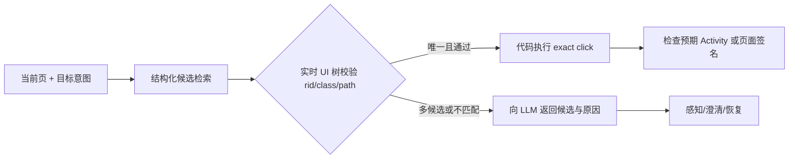

# RAG 对 LLM 元素定位准确性的评估与改进方案

> 日期：2026-08-05  
> 角色视角：高级 Agent 开发工程师 + 高级测试开发工程师  
> 范围：`test-20260805_134021` 首次运行、`test-20260805_135924` 复跑，以及当前 RAG/点击实现。

## 1. 结论

当前 RAG 数据库中已有能帮助定位的高价值信息，例如 App 包名、Activity、元素 label、`rid`、`class`、`path`、前后页面和历史成功次数；但它在运行时主要以 Markdown 文本提供给 LLM，尚未稳定地变成受当前 UI 校验的精确点击参数。

因此，当前问题的优先级是：

1. **P0：检索结果到点击执行的结构化转换缺失。** 先解决“命中但没有执行”的问题，而不是优先继续扩充语料。
2. **P0：缺少以当前页面和实时元素树为硬约束的重排与校验。** 仅语义相关不代表当前可点击。
3. **P1：知识质量分数缺乏负向反馈。** 现有大量 `quality_score=1.0` 不能表达路径是否稳定、是否已过期、是否曾导致恢复或失败。
4. **P1：回放 recovery 未消费 RAG。** 复跑偏离脚本时没有利用数据库中的恢复路径。

新增加的“课程表创建/管理导航路径” curated rule 是正确的候选知识：它明确了标题、`+` 按钮和“课程表设置”的真实语义。但该规则写入时间晚于本文分析的两次运行，且复跑没有调用 RAG；**它尚未在实际运行中产生效果，不能作为本次运行的成功证据。**

## 2. 日志证据

### 2.1 首次运行：命中了知识，但没有形成直接定位

来源：[134021 LangChain 日志](../logs/runs/134021_test-20260805_134021_langchain.log) 和 [134021 trace](../logs/runs/135903_test-20260805_134021_trace.json)。

| 指标 | 观测值 | 含义 |
|---|---:|---|
| verdict | `passed` | 首次探索最终完成任务 |
| LLM 调用 | 114 | 探索和反复判断开销高 |
| 总 token | 9,639,908 | 定位过程没有被有效收敛 |
| 点击数 | 40 | 路径包含大量探索和重复操作 |
| RAG 查询数 | 7 | RAG 实际被调用 |
| same-app ratio | 1.0 | 检索对象属于当前 App |
| empty-hit rate | 0 | 没有空检索 |

7 次 `query_app_knowledge` 的返回包含类似 `click_exact("...") rid=... class=... path=...` 的经验。然而每次查询后的第一个 `click` 结果为：

| RAG step | 后续首个 click 参数 | 结论 |
|---:|---|---|
| 3、4 | `index=3` | 两次近重复查询均未转为 locator |
| 13、16 | `index=1` | 未使用返回的 `rid/class/path` |
| 19 | `index=23` | 未使用返回的定位字段 |
| 52 | `label="09:00\n09:50"`，semantic fallback | 唯一文本点击仍发生 fallback |
| 54 | `index=4` | 未使用返回的定位字段 |

这说明 `rag_same_app_ratio=1.0` 和 `rag_empty_hit_rate=0` 只证明“检索到同 App 文本”，不能证明“RAG 帮助了元素定位”。当前应新增“检索结果是否被执行”指标，而不能以命中率代替效果。

### 2.2 复跑：效率来自 execution plan，不来自 RAG

来源：[135924 LangChain 日志](../logs/runs/135924_test-20260805_135924_langchain.log) 和 [135924 trace](../logs/runs/140221_test-20260805_135924_trace.json)。

| 指标 | 观测值 | 含义 |
|---|---:|---|
| verdict | `inconclusive` | 脚本探索噪声导致恢复失败 |
| LLM 调用 | 3 | 已录制脚本显著减少推理 |
| 总 token | 191,363 | 相比首次运行下降约 98% |
| 点击数 | 10 | 动作被压缩为脚本执行 |
| exact click rate | 1.0 | 已使用 `rid/class/path` 精确点击 |
| RAG 查询数 | 0 | RAG 未参与本次复跑 |

本次精确点击来自 execution plan，而不是 RAG：例如 `iv_more`、`课程表`、标题、取消按钮均带有 `rid/class/path`。复跑的 `NOT_FOUND` 来自脚本中已有探索行为：点击标题后取消、误点 `+` 打开导入面板，随后“课程表设置”被弹层阻塞。故不能将复跑问题归因于 RAG 数据质量。

## 3. 当前实现的边界

### 3.1 已有能力

- [tools/knowledge_tools.py](../tools/knowledge_tools.py) 中的 `query_app_knowledge` 已采用经验质量召回和语义召回合并、去重、轻量重排，并按页面签名缓存。
- [data/knowledge.py](../data/knowledge.py) 已保存 experience 的 `page_norm`、`to_page_norm`、`rid_tail`、`success_count`、`last_verified_at` 等元数据。
- [tools/click.py](../tools/click.py) 会在成功点击后保存元素身份；[data/relational.py](../data/relational.py) 支持按 `app_package + page_signature + alias` 读取历史身份。
- [agents/rag_context.py](../agents/rag_context.py) 有 RAG 文本解析为 click preference 的尝试，并支持失败、循环、无进展时触发 RAG。

### 3.2 关键断点

`query_app_knowledge` 的公开返回值是自然语言字符串。它没有返回带置信度和页面约束的 `locator` 数据结构，调用者也没有得到“可直接执行 / 仅供参考 / 不适用”的明确结论。

因此当前链路是：



应改为：



## 4. 推荐设计：Locator RAG，而不是文本 RAG

### 4.1 新增结构化查询契约（P0）

新增内部能力 `resolve_locator(intent, app_package, current_page)`；不要求立即暴露给 LLM。它应返回候选对象，而非 Markdown：

```json
{
  "decision": "execute_exact",
  "reason": "当前页面和实时元素均匹配",
  "locator": {
    "label": "课程表设置",
    "rid": "com.zui.calendar:id/action_curriculum_table_settings",
    "class_name": "android.widget.Button",
    "path_contains": "action_bar_root > content > toolbar"
  },
  "precondition": {
    "page_norm": "TimetableActivity",
    "page_signature": "TimetableActivity「...」"
  },
  "postcondition": {"expected_activity": "TimetableListActivity"},
  "confidence": 0.96,
  "source": "element_identity+experience"
}
```

`decision` 只能取：

- `execute_exact`：唯一候选且通过实时 UI 校验，代码直接调用 `click`。
- `ask_llm`：候选不足或存在歧义，向 LLM 返回不超过 3 个候选和差异。
- `perceive_first`：当前 Activity/页面签名不匹配，先 `get_screen_info`，禁止使用历史 locator。
- `no_match`：没有可信候选，允许正常探索或 recovery。

### 4.2 检索与排序必须分层（P0）

1. **层 0：实时元素树。** 当前页面上不存在的 `rid/class/path` 不得执行，即使向量相似度很高。
2. **层 1：元素身份库。** 先查 `app_package + current_page_signature + alias`；命中后校验实时树的 `rid/class/path`。
3. **层 2：结构化 experience。** 只检索 `page_norm == current_activity` 的经验，按 `intent/alias`、`rid`、`to_page_norm` 排序。
4. **层 3：向量 RAG。** 仅用于补齐别名、路径说明和恢复路线；不能单独授权点击。
5. **层 4：curated rule。** 作为正向路径或负向约束，例如“标题不是列表入口”“+ 不是新建入口”。

推荐初始评分：

$$
S = 0.35P + 0.25U + 0.15R + 0.10T + 0.10H + 0.05A
$$

其中 $P$ 为当前页面匹配，$U$ 为实时 UI locator 匹配，$R$ 为 `rid` 匹配，$T$ 为目标页面匹配，$H$ 为历史成功率，$A$ 为时效/App 版本匹配。若 $P$ 或 $U$ 为 0，则不得返回 `execute_exact`。

### 4.3 负向知识必须可执行（P0）

新规则中的“标题会打开切换对话框”“+ 会打开导入面板”不能只写成提示文本。将其存成带条件的禁止边：

```json
{
  "page_norm": "TimetableActivity",
  "locator": {"rid": "com.zui.calendar:id/toolbar_title"},
  "intent": "进入课程表列表",
  "decision": "reject",
  "reason": "该元素打开切换课表弹窗，不进入 TimetableListActivity"
}
```

在 Agent 生成 click 前和 replay recovery 尝试前都执行一次规则检查；命中 `reject` 时返回原因和替代候选“课程表设置”。这能直接阻止已知死胡同，而不依赖 LLM 记住长文本。

### 4.4 回放模式的最小消费策略（P1）

- script 模式：只执行 execution plan，保持当前低 token 优势；不查询 RAG。
- recovery 模式：第一次 `NOT_FOUND`、Activity 不符或检测到阻塞弹层后，执行一次 `resolve_locator`。
- 若返回负向规则：先 `press_key(back)` 或 `dismiss_popup`，再使用替代 locator。
- 恢复预算内，相同 `(page_signature, intent)` 的 RAG 查询只能执行一次，防止重复注入和循环。

## 5. 数据质量治理

### 5.1 写入准入

只把满足以下条件的经验升格为可执行 locator：

- 点击成功，且实时 `rid/class/path` 至少有两个稳定字段；
- postcondition Activity 或页面签名符合预期；
- 同一 locator 在至少 2 个独立 run 成功，或经人工确认；
- 非探索闭环、非取消回退、非仅临时弹层动作；
- 使用 App 版本和屏幕规格可兼容，或有兼容范围。

首次成功但未重复验证的记录标记 `candidate`，只能供 LLM 参考，不能 direct execute。

### 5.2 质量模型与失效

为 experience/identity 增加：`attempt_count`、`success_count`、`not_found_count`、`postcondition_pass_count`、`last_failed_at`、`app_version`、`verified_run_count`。

建议以 Beta 平滑计算可靠性，避免一次成功得到满分：

$$
reliability = \frac{success\_count + 1}{attempt\_count + 2}
$$

发生 `NOT_FOUND`、页面不符、postcondition 失败时立即记录负样本并降权；连续两次失败的 locator 从 `execute_exact` 降为 `ask_llm`，等待再次人工或独立 run 验证。

### 5.3 清理与版本化

- 继续保留 [rag_data_quality_improvement_plan_20260709.md](rag_data_quality_improvement_plan_20260709.md) 中的去重、App 优先、跨场景降噪工作。
- 把旧的自然语言 `action` 逐步解析迁移到 `locator`、`precondition`、`postcondition` 字段；解析失败的条目只作文本参考。
- 每次清理先 dry-run，输出按 App、Activity、locator 的删除/合并清单；保留 Chroma 和关系库备份。

## 6. 测试与验收

### 6.1 必测场景

基于最新日志固化以下 fixture：

1. `AllInOneActivity`：`iv_more` -> “课程表”。
2. `TimetableActivity`：`课程表设置` -> `TimetableListActivity`。
3. 负向：标题 `toolbar_title` 不得被用于“进入列表”。
4. 负向：`+` 不得被用于“新建课程表”。
5. 弹层阻塞时：recovery 应先消解弹层，再解析“课程表设置”。
6. UI 中 `rid` 不存在或 Activity 不符时：不得 direct execute 历史 locator。

### 6.2 指标

新增并在 `test_runs`/报告中按 run_type 统计：

| 指标 | 定义 | 初始目标 |
|---|---|---:|
| `rag_locator_candidate_count` | 返回的结构化 locator 数 | 可观测 |
| `rag_locator_execute_count` | 经实时校验后的直接执行次数 | 可观测 |
| `rag_locator_live_match_rate` | 直接执行前通过实时树校验的比例 | >= 0.98 |
| `rag_locator_postcondition_rate` | 直接执行后满足 postcondition 的比例 | >= 0.95 |
| `rag_locator_not_found_rate` | direct execute 后的 `NOT_FOUND` 比例 | < 0.02 |
| `rag_rejected_dead_end_count` | 被负向规则阻止的死胡同数 | 可观测 |
| `rag_action_adoption_rate` | 查询后实际采用候选 locator 的比例 | >= 0.70 |
| `recovery_rag_success_rate` | recovery 查询后重新对齐脚本的比例 | >= 0.70 |

现有 `rag_query_count`、`rag_same_app_ratio`、`rag_empty_hit_rate` 继续保留，但仅作为检索健康度指标，不作为定位效果指标。

### 6.3 上线顺序

1. 先实现结构化候选、实时树校验和 direct-execute 闸门；为上述六个 fixture 写单测。
2. 接入元素身份库作为最高优先级来源，并记录执行/后置条件结果。
3. 为 experience 增加负反馈和可靠性字段，迁移既有高价值记录。
4. 在 replay recovery 接入一次性结构化查询和负向规则。
5. 灰度启用，连续 50 个 run 观察 `postcondition_rate`、`NOT_FOUND`、通过率和 token；任一关键通过率下降超过 2% 时回退到“仅向 LLM 展示候选”的模式。

## 7. 最终判断

这套项目不需要把 RAG 做成更大的“经验文本库”，而要把它收敛为**经过当前 UI 验证的 locator 决策层**：关系库负责精确身份，经验库负责页面转换，curated rule 负责业务语义和禁止边，LLM 只处理歧义、缺失信息和 recovery 判断。

这样既能复用已有 RAG 数据，也能避免历史知识绕过实时页面事实；并能把“检索命中”转化为可验证的“定位成功”。